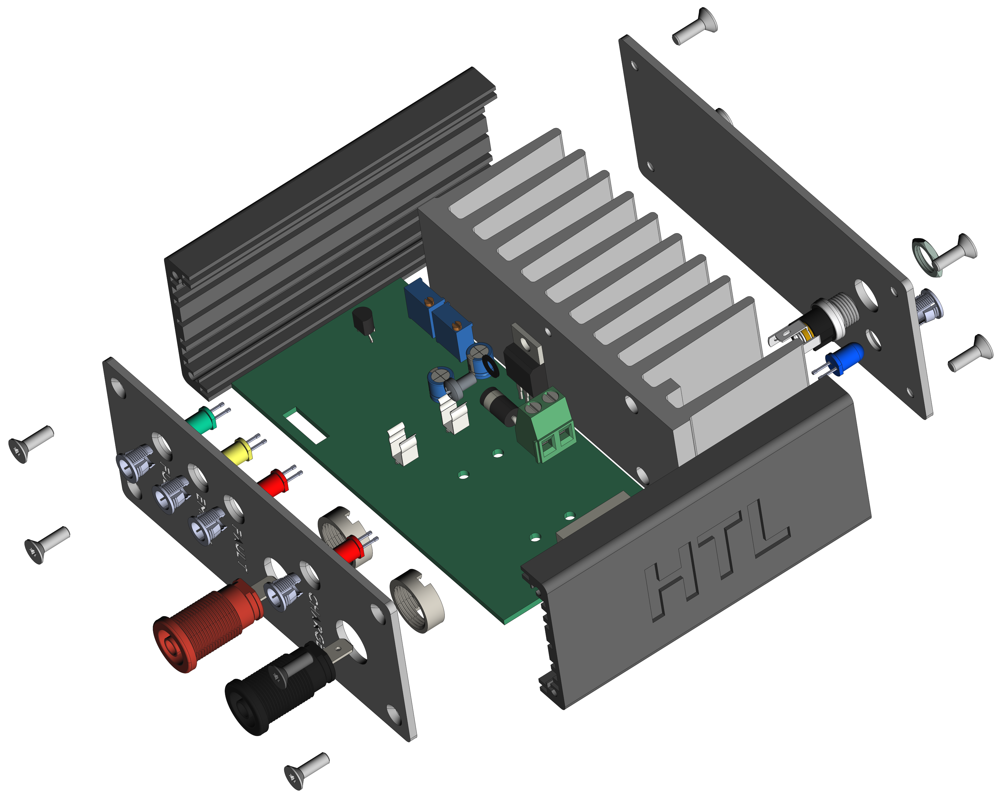

  

# `BLR` - Lead Battery Charger (Bleiakkuladeregler)

The `BLR` project is based on a pcb with a positive voltage regulator for battery charging (`PB137`).It can be used to charge [lead-batteries](#additional-information) with a voltage of 12V and observe the status of a battery during use.

| Experience | Level |
|:------------|:-----:|
| Soldering   |  |
| Software    |  |

# Downloads

| Type      | File               | Description              |
|:---------:|:------------------:|:-------------------------|
| Simulation | [asc](https://github.com/0x007E/blr/raw/refs/heads/main/BLR.asc) | LTSpice Simulation | 
| Lochmaster | [lm4](https://github.com/0x007E/blr/raw/refs/heads/main/BLR.LM4) | Stripe grid circuit board | 
| Schematic | [pdf](https://github.com/0x007E/blr/releases/latest/download/schematic.pdf) / [cadlab](https://cadlab.io/project/28581/main/files) | Schematic files |
| Board | [pdf](https://github.com/0x007E/blr/releases/latest/download/pcb.pdf) / [cadlab](https://cadlab.io/project/28581/main/files) | Board file |
| Drill | [pdf](https://github.com/0x007E/blr/releases/latest/download/drill.pdf) | Drill file |
| Gerber | [zip](https://github.com/0x007E/blr/releases/latest/download/kicad.zip) / [tar](https://github.com/0x007E/blr/releases/latest/download/kicad.tar.gz) | Gerber/Drill files |
| Housing, PCB | [zip](https://github.com/0x007E/blr/releases/latest/download/freecad.zip) / [tar](https://github.com/0x007E/blr/releases/latest/download/freecad.tar.gz) | Housing and PCB (STEP) files     |

# Hardware

There are two parts of the hardware. The pcb and the housing of the `BLR`. The pcb is created with `KiCAD` and the housing with `FreeCAD`. All files are built with `github actions` so that they are ready for a production environment. The housing is printed with a 3D-printer (`Dremel 3D40`).

## PCB

The circuit board is populated on both sides (Top, Bottom). The best way for soldering is within a vapor phase soldering system.

### Top Layer

### Bottom Layer

## Mechanical

The housing has a tolerance of `0.2mm` on each side of the case. So the pcb should fit perfectly in the housing. The tolerance can be modified with `FreeCAD` in the `Parameter` Spreadsheet (currently under construction).

### Assembled

#### Exploded

# Setup

To setup the `BLR` the reference Voltages of `TP1`, `TP2`, `TP3` and `TP4` needs to be adjusted.

| Point | Voltage | UIn |
|:-----:|:-------:|:--------------:|
| `TP1` | ~2V5    | ~8V            | 
| `TP2` | ~2V5    | -              |
| `TP3` | ~2V5    | ~13V           |

> TP4 need to be adjusted manually with a Ampermeter. If the current is > `100 mA` the charging LED (`J8`) should be on. This behaviour can be adjusted through `RV3`.

# Additional Information

| Type       | Link               | Description              |
|:----------:|:------------------:|:-------------------------|
| PB137 | [pdf](https://www.st.com/resource/en/datasheet/pb137.pdf) | Positive voltage regulator for battery charging datasheet |
| TL431 | [pdf](https://www.ti.com/lit/ds/symlink/tl431.pdf) | Precision voltage reference |
| LM358 | [pdf](https://www.ti.com/lit/ds/symlink/lm358.pdf) | Dual operational amplifier |
| Battery | [web](https://at.rs-online.com/web/p/bleiakkus/8431310) | Lead battery with 12V |

---

R. GAECHTER
